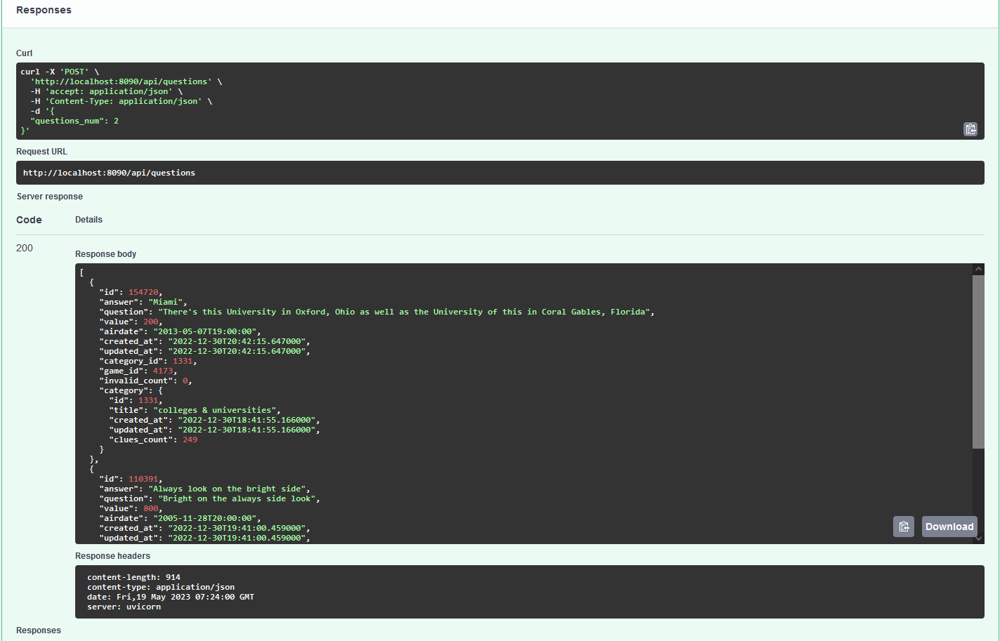
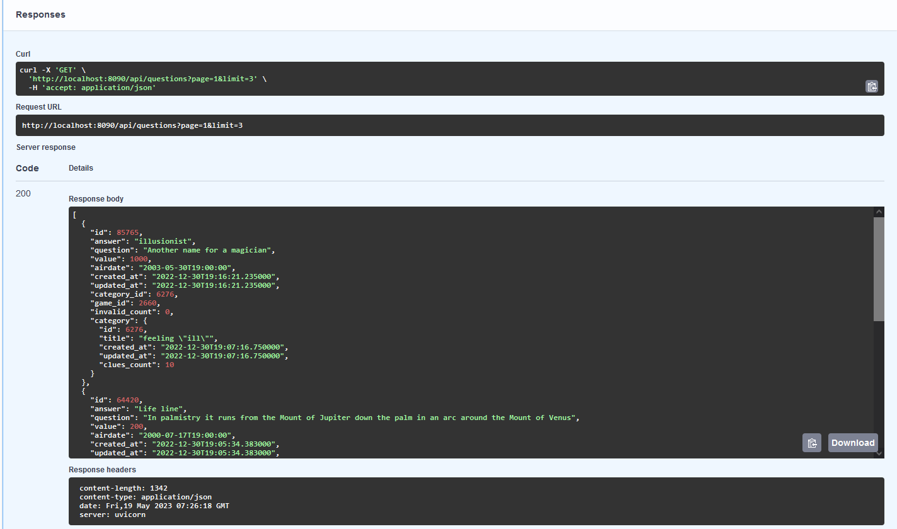

## Сервис викторины
Quiz Service - это веб-приложение, реализованное на языке Python 3 с использованием фреймворка FastAPI. Он позволяет пользователям получать случайные вопросы для викторины из публичного API и сохранять их в базе данных. Сервис предоставляет REST API с методом POST для обработки запросов.
Возможности

Получение случайных вопросов для викторины из публичного API
Сохранение вопросов в базе данных
Получение последнего сохраненного вопроса
Обработка дубликатов вопросов путем выполнения дополнительных запросов к API
Приложение, упакованное в Docker-контейнеры для удобного развертывания
Встроенная поддержка SQLAlchemy для работы с базой данных
### Структура каталогов
Структура каталогов проекта выглядит следующим образом:
```markdown
api
├── app
│   ├── app.py
│   ├── config.py
│   ├── models.py
│   ├── schemas.py
│   └── utils.py
└── db
    ├── base.py
    ├── base_class.py
    └── question_accessor.py
```

### api/app: Содержит основные файлы приложения.

+ app.py: Точка входа в приложение FastAPI.
+ config.py: Файл с настройками конфигурации приложения.
+ models.py: Определяет модели SQLAlchemy для базы данных.
+ schemas.py: Определяет схемы Pydantic для валидации запросов и ответов.
+ utils.py: Вспомогательные функции, используемые приложением.

  + api/db: Содержит файлы, связанные с базой данных.

+ base.py: Создает экземпляр базы данных SQLAlchemy.
+ base_class.py: Определяет базовый класс модели для моделей базы данных.
+ question_accessor.py: Реализует логику доступа и сохранения вопросов в базе данных.

### Предварительные требования

Убедитесь, что у вас установлены следующие зависимости:

+  Python 3.11
  +  Docker
    +  Docker Compose

### Начало работы
Для запуска сервиса викторины локально выполните следующие шаги:


Клонируйте репозиторий:
```
git clone https://github.com/your-username/quiz-service.git

cd quiz-service
```

Соберите Docker-образ и запустите контейнеры:
```
docker-compose up -d
```
При первом запуске в контейнере с API выполнить
```markdown
poetry run alembic upgrade head
```
Сервис должен быть доступен по адресу http://localhost:8090.


### API Endpoints
Сервис викторины предоставляет следующие API-точки:

+ POST /api/v1/questions

Эта точка входа генерирует указанное количество вопросов, запрашивая их с публичного API.
```
Параметры запроса

questions_num (integer): Количество вопросов для генерации.
Пример запроса:
POST /api/v1/questions
Content-Type: application/json

{
  "questions_num": 5
}
Пример ответа:
HTTP/1.1 200 OK
Content-Type: application/json

[
  {
    "id": 1,
    "answer": "Париж",
    "question": "Какая столица Франции?",
    "value": 200,
    "airdate": "2023-05-19T12:00:00Z",
    "created_at": "2023-05-19T12:00:00Z",
    "updated_at": "2023-05-19T12:00:00Z",
    "category_id": 1,
    "game_id": 1,
    "invalid_count": null,
    "category": {
      "id": 1,
      "title": "Столицы",
      "created_at": "2023-05-19T12:00:00Z",
      "updated_at": "2023-05-19T12:00:00Z",
      "clues_count": 10
    }
  },
  {
    "id": 2,
    "answer": "29",
    "question": "Сколько дней в феврале в високосном году?",
    "value": 300,
    "airdate": "2023-05-19T12:01:00Z",
    "created_at": "2023-05-19T12:01:00Z",
    "updated_at": "2023-05-19T12:01:00Z",
    "category_id": 2,
    "game_id": 2,
    "invalid_count": null,
    "category": {
      "id": 2,
      "title": "Календарь",
      "created_at": "2023-05-19T12:01:00Z",
      "updated_at": "2023-05-19T12:01:00Z",
      "clues_count": 5
    }
  },
  ...
]
```
+ GET /api/v1/questions
Эта точка входа получает вопросы из базы данных с пагинацией.
```
Параметры запроса

page (integer, default=1): Номер страницы результатов.
limit (integer, default=3): Количество вопросов на странице.
Пример запроса:
GET /api/v1/questions?page=2&limit=10
Пример ответа:
HTTP/1.1 200 OK
Content-Type: application/json

[
  {
    "id": 11,
    "answer": "2023",
    "question": "Какой год сейчас?",
    "value": 400,
    "airdate": "2023-05-19T12:20:00Z",
     "created_at": "2023-05-19T12:20:00Z",
    "updated_at": "2023-05-19T12:20:00Z",
    "category_id": 3,
    "game_id": 3,
    "invalid_count": null,
    "category": {
      "id": 3,
      "title": "Годы",
      "created_at": "2023-05-19T12:20:00Z",
      "updated_at": "2023-05-19T12:20:00Z",
      "clues_count": 8
    }
  },
  {
    "id": 12,
    "answer": "Python",
    "question": "Какой язык используется в сервисе викторины?",
    "value": 500,
    "airdate": "2023-05-19T12:21:00Z",
    "created_at": "2023-05-19T12:21:00Z",
    "updated_at": "2023-05-19T12:21:00Z",
    "category_id": 4,
    "game_id": 4,
    "invalid_count": null,
    "category": {
      "id": 4,
      "title": "Языки программирования",
      "created_at": "2023-05-19T12:21:00Z",
      "updated_at": "2023-05-19T12:21:00Z",
      "clues_count": 12
    }
  },
  ...
]
```
### Схема базы данных
Схема базы данных состоит из двух таблиц: categories и questions.
+ Таблица categories

```
id: Идентификатор категории (целое число, первичный ключ).
title: Заголовок категории (строка).
created_at: Дата и время создания (дата и время).
updated_at: Дата и время обновления (дата и время).
clues_count: Количество подсказок (целое число).
```
+ Таблица questions

```
id: Идентификатор вопроса (целое число, первичный ключ).
answer: Ответ на вопрос (строка).
question: Текст вопроса (строка).
value: Значение вопроса (целое число).
airdate: Дата и время вопроса (дата и время).
created_at: Дата и время создания (дата и время).
updated_at: Дата и время обновления (дата и время).
category_id: Идентификатор категории (целое число, внешний ключ).
game_id: Идентификатор игры (целое число).
invalid_count: Количество недействительных вопросов (целое число).
category: Категория вопроса (связь с таблицей categories).
```
Примечание: Схема базы данных представлена с использованием ORM (Object-Relational Mapping) с помощью SQLAlchemy.
### Зависимости
Зависимости проекта управляются с помощью Poetry. Файл pyproject.toml содержит список зависимостей.
Дополнительная информация

Документация FastAPI: https://fastapi.tiangolo.com/
Документация SQLAlchemy: https://docs.sqlalchemy.org/


### Примеры работы
+ Генерация вопросов

Чтобы сгенерировать вопросы, отправьте POST-запрос на эндпоинт /questions с указанием количества вопросов. В ответ вы получите сгенерированные вопросы.

Пример запроса:
```markdown
$ curl -X POST -H "Content-Type: application/json" -d '{"questions_num": 5}' http://localhost:8000/questions
```
Пример ответа:



+ Получение вопросов

Чтобы получить список вопросов с пагинацией, отправьте GET-запрос на эндпоинт /questions с указанием номера страницы и лимита вопросов на странице. В ответ вы получите список вопросов.

Пример запроса:
```
$ curl -X GET http://localhost:8000/questions?page=1&limit=3
```
Пример ответа:

